# Práctica 2: Sistema IoT con Sensor y Actuador

**Integrante**

- Nicole Gomez

## 1. Requerimientos Funcionales y No Funcionales

### 1.1 Requerimientos funcionales

Los requerimientos funcionales describen las acciones principales que realiza el sistema y la responsabilidad de cada componente.

- El sistema debe conectar tres componentes principales dentro de una red WiFi local: sensor ESP32, servidor TCP y actuador ESP32.
- El sensor ESP32 debe medir la distancia de un objeto mediante un sensor ultrasónico HC-SR04.
- El sensor debe registrarse en el servidor como `sensor`.
- El sensor debe enviar al servidor la distancia medida mediante comunicación TCP.
- El servidor debe recibir la información enviada por el sensor.
- El servidor debe procesar la distancia recibida y determinar la acción correspondiente según el rango medido.
- El servidor debe enviar al actuador un comando para encender el LED RGB con el color correspondiente o apagarlo cuando la distancia esté fuera del rango definido.
- El actuador ESP32 debe registrarse en el servidor como `actuator`.
- El actuador debe recibir comandos desde el servidor y ejecutar la acción sobre el LED RGB.
- El actuador debe mantener el último estado recibido hasta que el servidor envíe un nuevo comando.
- El flujo funcional del sistema debe ser: el sensor mide la distancia, envía los datos al servidor, el servidor procesa la información, el servidor envía un comando al actuador y el actuador enciende o apaga el LED RGB.
- El servidor debe sincronizar a un actuador recién conectado con el último estado de LED calculado.
- El servidor debe enviar un nuevo comando al actuador solo cuando exista un cambio de rango confirmado por tres lecturas consecutivas.

### 1.2 Requerimientos no funcionales

- La comunicación debe realizarse sobre TCP para asegurar entrega ordenada de mensajes entre sensor, servidor y actuador.
- Los mensajes deben enviarse en formato JSON y separarse con salto de línea (`\n`).
- El sensor debe enviar mediciones cada 1 segundo para evitar saturación de la red y del servidor.
- El servidor debe aceptar múltiples clientes conectados.
- El sistema debe funcionar dentro de una red WiFi local con conectividad entre los dispositivos.
- El protocolo debe usar campos definidos y documentados para evitar ambigüedad en la interpretación de mensajes.
- El sistema debe intentar reconectarse cuando un ESP32 pierda conexión con el servidor.
- El servidor debe escuchar en `0.0.0.0` para aceptar conexiones desde otros equipos de la red local.
- Los ESP32 deben conectarse a la dirección IPv4 local de la computadora que ejecuta el servidor.
- El puerto TCP `5000` debe estar permitido en el firewall de Windows para conexiones entrantes.
- El campo `duration` debe conservarse en el protocolo por compatibilidad, aunque el actuador mantiene el estado hasta recibir un nuevo comando.
- La estabilidad del sistema depende de la calidad de la red WiFi, la precisión del sensor ultrasónico y la capacidad del hardware utilizado.

El comportamiento del LED RGB se define mediante los siguientes rangos de distancia:

| Rango de distancia | Color o estado | Valor `rgb` enviado |
|---|---|---|
| `0 cm <= distancia < 10 cm` | Rojo | `[255, 0, 0]` |
| `10 cm <= distancia <= 20 cm` | Azul | `[0, 0, 255]` |
| `20 cm < distancia <= 30 cm` | Verde | `[0, 255, 0]` |
| `distancia > 30 cm` | Apagado | `[0, 0, 0]` |

### 1.3 Correspondencia con la implementación

| Requerimiento | Evidencia en el proyecto |
|---|---|
| Medición de distancia con sensor ultrasónico | `esp32scripts/Sensor/src/sensor.cpp`, función `measureDistance()` |
| Envío de mediciones por TCP | `esp32scripts/Sensor/src/sensor.cpp`, función `loop()` |
| Recepción y procesamiento en servidor | `server/server.py`, función `process_message()` |
| Registro de sensor y actuador | `server/client_manager.py`, clase `ClientManager` |
| Envío de comandos al actuador | `server/server.py`, función `send_to_actuators()` |
| Activación de salidas de LED | `esp32scripts/Actuator/src/actuator.cpp`, función `processCommand()` |
| Rangos de distancia y valores RGB | `server/server.py`, función `led_state_for_distance()` |
| Cambio de LED solo ante cambio estable | `server/server.py`, atributos `current_led_rgb`, `pending_led_rgb` y `required_stable_readings` |

## 2. Diseño del Sistema

El sistema usa una arquitectura cliente-servidor. El servidor centraliza la lógica de decisión; el sensor solo mide y envía datos, mientras que el actuador recibe comandos y ejecuta la acción sobre los LEDs indicadores conectados a sus salidas. El sensor y el actuador no se conectan directamente entre sí; ambos se comunican con el servidor TCP.

| Componente | Función principal |
|---|---|
| Sensor ESP32 | Mide distancia y envía datos al servidor. |
| Servidor TCP | Registra clientes, procesa distancias y genera comandos solo cuando cambia el estado del LED. |
| Actuador ESP32 | Recibe comandos, controla las salidas de LED y mantiene el último color recibido. |

### 2.1 Diagrama de bloques

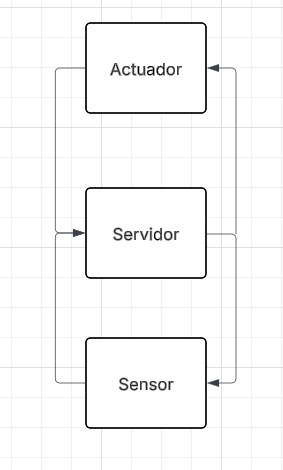

*Figura 1. Relación general entre sensor, servidor y actuador.*

### 2.2 Diagrama de circuito

**Circuito del sensor**

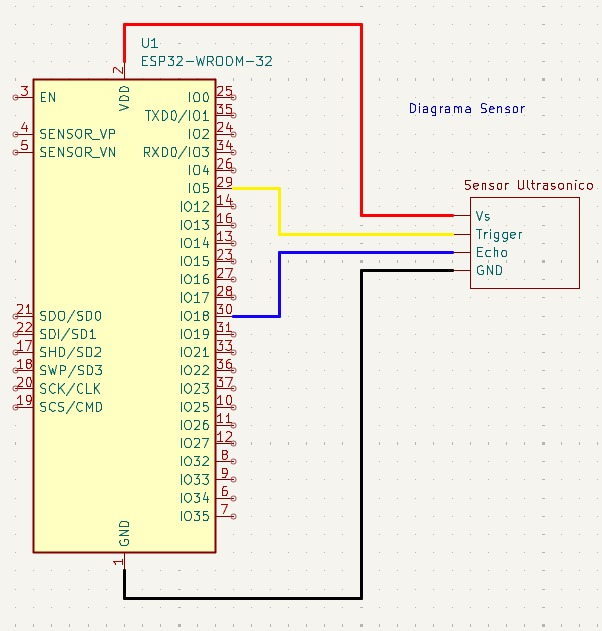

*Figura 2. Conexión del sensor ultrasónico con el ESP32.*

**Circuito del actuador**

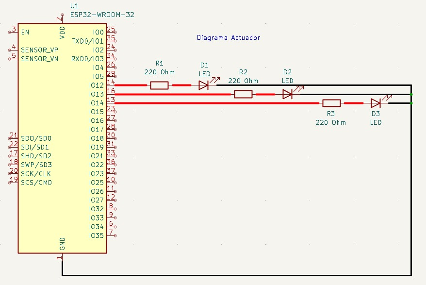

*Figura 3. Conexión del ESP32 actuador con las salidas de LED.*

### 2.3 Diagrama de arquitectura del sistema


*Figura 4. Arquitectura cliente-servidor utilizada en la práctica.*

### 2.4 Especificación del protocolo de aplicación

El protocolo de aplicación usa mensajes JSON sobre TCP. Cada mensaje termina con `\n` para que el servidor pueda separarlos por unidad de mensaje.

**Puerto de comunicación**

| Parámetro | Valor |
|---|---|
| Protocolo de transporte | TCP |
| Host del servidor | `0.0.0.0` |
| Dirección usada por los ESP32 en la prueba | `192.168.0.4` |
| Puerto | `5000` |
| Formato de mensaje | JSON |
| Separador | Salto de línea (`\n`) |

**Registro de dispositivo**

```json
{
  "message_type": "register",
  "id": "ESP32_SENSOR_01",
  "device_type": "sensor"
}
```

**Envío de datos del sensor**

```json
{
  "message_type": "sensor_data",
  "id": "ESP32_SENSOR_01",
  "distance": 15.2
}
```

**Comando hacia el actuador**

```json
{
  "message_type": "command",
  "command": "leds",
  "rgb": [0, 0, 255],
  "duration": 500
}
```

El campo `rgb` se mantiene como parte del protocolo del código fuente. En este reporte representa los canales de salida rojo, verde y azul usados para activar LEDs indicadores. El campo `duration` se conserva por compatibilidad, pero el actuador actualizado no apaga el LED por tiempo; mantiene el color hasta recibir un nuevo comando.

**Confirmación del actuador**

```json
{
  "message_type": "command_response",
  "id": "ESP32_ACTUADOR_01",
  "command": "leds",
  "result": "ok"
}
```

El servidor conserva compatibilidad con claves anteriores en español, como `tipo`, `dispositivo_tipo`, `distancia`, `comando`, `duracion` y `resultado`. Si un actuador se registra después de que el servidor ya tiene un estado LED calculado, el servidor le envía el último estado conocido para sincronizarlo.

### 2.5 Diagramas estructurales y de comportamiento

**Diagrama de clases**

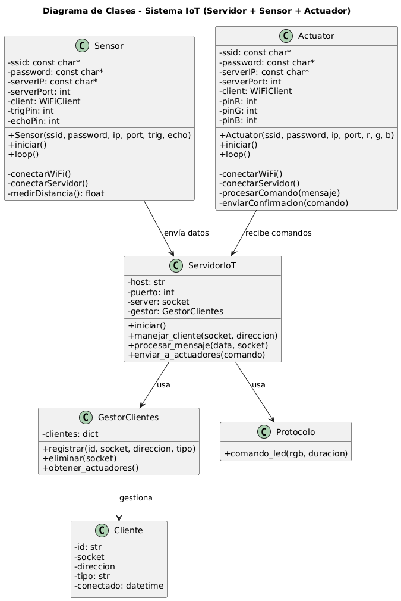

*Figura 5. Estructura principal de clases del servidor y los dispositivos.*

**Diagrama de comportamiento**


*Figura 6. Secuencia general de medición, procesamiento y actuación.*

**Diagrama de comportamiento del protocolo**


*Figura 7. Flujo de mensajes del protocolo de aplicación.*

## 3. Implementación

### 3.1 Servidor TCP en Python

El servidor se encuentra en `Prectice2/SourceCode/server`.

| Archivo | Responsabilidad |
|---|---|
| `main.py` | Punto de entrada para ejecutar el servidor TCP. |
| `server.py` | Acepta conexiones, procesa mensajes, conserva el estado actual del LED y envía comandos. |
| `client_manager.py` | Administra sensores y actuadores conectados. |
| `protocol.py` | Define claves, tipos de mensaje y comandos JSON. |
| `run_tcp_server.bat` | Ejecuta el servidor desde Windows. |

Para ejecutar el servidor:

```powershell
python main.py --host 0.0.0.0 --port 5000
```

El archivo `main.py` usa `0.0.0.0` como host por defecto para evitar errores de enlace cuando la IP fija configurada no pertenece a la computadora. Los ESP32 no usan `0.0.0.0` para conectarse; usan la IP local real del servidor, que en la prueba fue `192.168.0.4`.

### 3.2 Código fuente documentado

El código está organizado por responsabilidad:

- `IoTServer`: inicia el socket TCP, acepta clientes, procesa mensajes y guarda el último estado LED enviado.
- `ClientManager`: registra, elimina y filtra clientes conectados.
- `Protocol`: centraliza el formato JSON del protocolo de aplicación.
- `Sensor`: conecta a WiFi, mide distancia, envía datos al servidor y muestra diagnósticos por monitor serial.
- `Actuator`: conecta a WiFi, recibe comandos, controla las salidas de los LEDs indicadores con salidas digitales fijas y mantiene el color activo hasta el siguiente cambio.

### 3.3 Sensor ESP32

El sensor se encuentra en `Prectice2/SourceCode/esp32scripts/Sensor`.

Funciones principales:

- Conectarse a la red WiFi.
- Conectarse al servidor TCP.
- Medir distancia con el sensor ultrasónico.
- Enviar la distancia al servidor cada 1 segundo.
- Mostrar por monitor serial la IP local del ESP32, gateway y servidor configurado.

Fórmula utilizada:

```text
distancia = duración * 0.034 / 2
```

### 3.4 Actuador ESP32

El actuador se encuentra en `Prectice2/SourceCode/esp32scripts/Actuator`.

Funciones principales:

- Conectarse a la red WiFi.
- Registrarse en el servidor como actuador.
- Recibir comandos JSON.
- Activar las salidas de LED según los valores recibidos en el campo `rgb`.
- Mantener encendido el último color recibido hasta que llegue otro comando.
- Ignorar comandos repetidos del mismo color para evitar parpadeos innecesarios.
- Enviar confirmación al servidor.

La versión actual usa los GPIO `32`, `25` y `26` para las salidas del LED RGB. Se evitó el uso de `GPIO24` porque en placas ESP32 comunes no está disponible como salida general. El actuador aplica los colores con `digitalWrite`, por lo que el LED queda fijo en encendido o apagado según el último comando recibido.

### 3.5 Configuración de red y diagnóstico

Durante la puesta en marcha se corrigió la configuración del servidor para evitar el error `WinError 10049`. El servidor escucha en `0.0.0.0:5000`, lo que permite aceptar conexiones desde cualquier interfaz de red de la computadora. Los ESP32 se conectan a la IP IPv4 real de la computadora dentro de la red local; en la prueba se usó `192.168.0.4`.

Salida esperada del servidor al iniciar:

```text
IoT server started on 0.0.0.0:5000
--------------------------------------------------
```

Esa salida indica que el servidor está activo y esperando conexiones. Cuando los ESP32 se conectan, el servidor muestra el origen TCP y el registro del dispositivo.

Salida esperada en monitor serial del actuador:

```text
[ACTUADOR] Iniciando...
[WiFi] Conectado. IP del ESP32: 192.168.0.x
[ACTUADOR] Conectando a servidor 192.168.0.4:5000
[ACTUADOR] Registrado con el servidor
```

Si aparece `Error de conexion`, se debe revisar que la computadora y los ESP32 estén en la misma red, que la IP del servidor sea correcta y que el firewall permita el puerto TCP `5000`.

## 4. Pruebas y Validaciones

### 4.1 Prueba de funcionamiento por rangos

| Distancia medida | Acción esperada | Comportamiento actualizado |
|---:|---|---|
| 0 cm a menos de 10 cm | LED rojo | Permanece encendido hasta cambio estable de rango |
| 10 cm a 20 cm | LED azul | Permanece encendido hasta cambio estable de rango |
| Mayor a 20 cm y hasta 30 cm | LED verde | Permanece encendido hasta cambio estable de rango |
| Mayor a 30 cm | LED apagado | Permanece apagado hasta cambio estable de rango |

Evidencias:

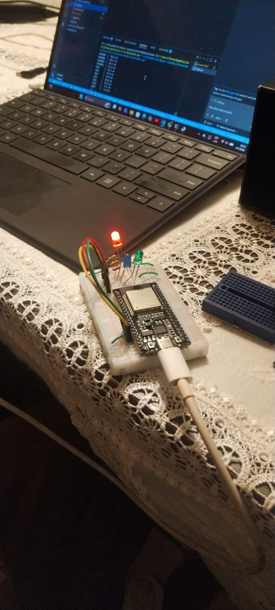

*Figura 8. Activación del indicador rojo para distancia desde 0 cm y menor a 10 cm.*

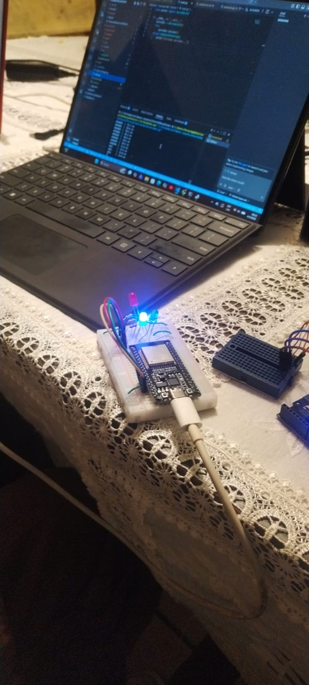

*Figura 9. Activación del indicador azul para distancia desde 10 cm hasta 20 cm.*

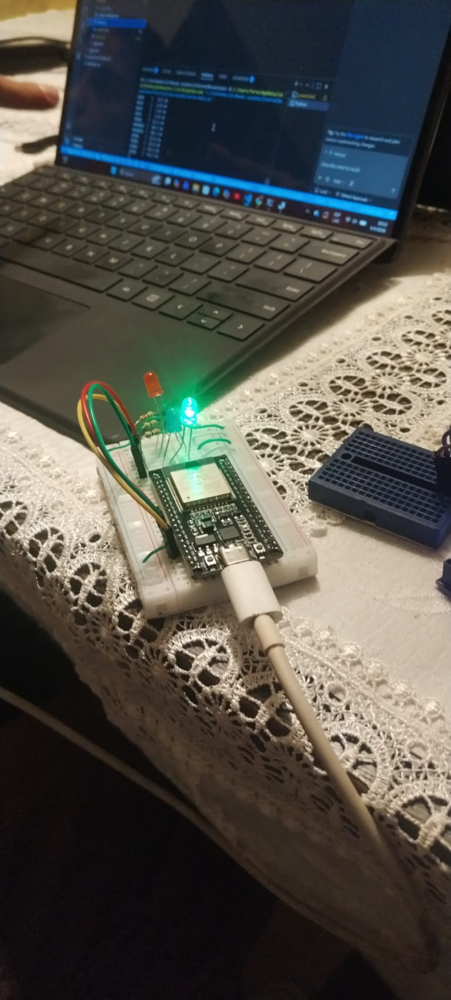

*Figura 10. Activación del indicador verde para distancia mayor a 20 cm y hasta 30 cm.*

### 4.2 Integridad de mensajes

Se verificó que los mensajes JSON enviados entre sensor, servidor y actuador lleguen completos durante la comunicación TCP.

Resultado:

- No se detectaron mensajes incompletos.
- Los datos recibidos conservaron el formato esperado.
- TCP permitió mantener orden e integridad en la transmisión.

Evidencias:


*Figura 11. Captura de mensajes usados para revisar integridad de transmisión.*


*Figura 12. Continuación de la revisión de mensajes transmitidos.*

### 4.3 Velocidad de envío de paquetes

| N | Diferencia (s) |
|---:|---:|
| 1 | 0.79 |
| 2 | 0.60 |
| 3 | 0.66 |
| 4 | 0.77 |
| 5 | 0.80 |
| 6 | 0.81 |
| 7 | 0.81 |
| 8 | 0.82 |
| 9 | 0.91 |
| 10 | 0.85 |

Promedio aproximado:

```text
0.782 s
```

Evidencias:

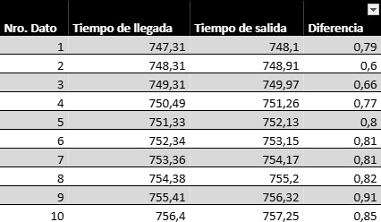

*Figura 13. Registro usado para calcular tiempos de envío.*

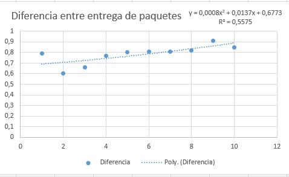

*Figura 14. Diferencias medidas entre entregas de paquetes.*

### 4.4 Prueba de uso prolongado

Se ejecutó el sistema durante varios minutos para observar continuidad de operación.

Resultado:

- Durante los primeros minutos se registró recepción de datos y ejecución de comandos sin desconexiones reportadas en la salida del servidor.
- La versión actual reduce comandos repetidos porque el servidor solo reenvía cambios de estado del LED después de tres lecturas consecutivas en el nuevo rango.
- Después de uso prolongado se observaron errores de transmisión.
- La evidencia disponible no permite confirmar una causa única; se considera como posible causa la saturación de recursos en el ESP32.

Evidencia:

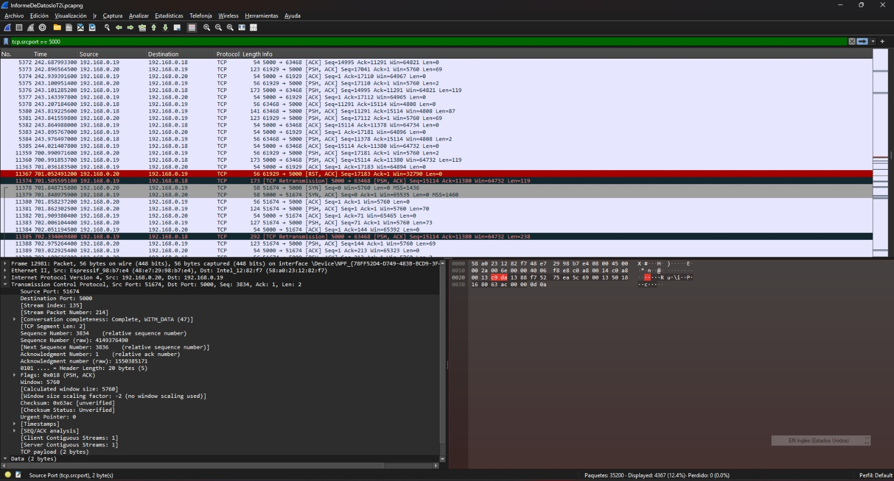

*Figura 15. Evidencia de errores observados durante uso prolongado.*

## 5. Resultados

Las pruebas realizadas muestran que el servidor recibió mensajes del sensor, registró dispositivos y generó comandos para el actuador dentro de la red local. En la versión actual, el comando se envía al actuador cuando cambia el rango de distancia y el nuevo rango se mantiene durante tres lecturas consecutivas; si la distancia permanece en el mismo rango, el LED mantiene su estado.

| Rango de distancia | Salida activada | Estado del LED |
|---|---|---|
| `0 cm <= distancia < 10 cm` | Rojo `[255, 0, 0]` | Encendido hasta nuevo cambio estable |
| `10 cm <= distancia <= 20 cm` | Azul `[0, 0, 255]` | Encendido hasta nuevo cambio estable |
| `20 cm < distancia <= 30 cm` | Verde `[0, 255, 0]` | Encendido hasta nuevo cambio estable |
| `distancia > 30 cm` | Apagado `[0, 0, 0]` | Apagado hasta nuevo cambio estable |

Los valores de `duration` permanecen dentro del protocolo por compatibilidad con versiones anteriores, pero el actuador actualizado ya no usa ese valor para apagar automáticamente el LED.

Ejemplo de salida del servidor:

```text
IoT server started on 0.0.0.0:5000
[TCP] Connection from 192.168.0.20:49152
[+] Registered ESP32_ACTUADOR_01 (actuator)
[+] Registered ESP32_SENSOR_01 (sensor)
RED      |   5.2 cm
BLUE     |  15.8 cm
GREEN    |  24.3 cm
OFF      |  42.1 cm
```

En la prueba de velocidad de envío se registraron 10 mediciones con un promedio aproximado de `0.782 s`. Los valores observados estuvieron entre `0.60 s` y `0.91 s`.

No se define un umbral formal de aceptación para calificar el tiempo de respuesta; por este motivo, el resultado se reporta únicamente como dato medido.

## 6. Conclusiones

- Se verificó comunicación TCP entre sensor, servidor y actuador durante las pruebas realizadas en red local.
- El servidor recibió distancias y generó comandos de activación de LEDs según los rangos definidos en la tabla de resultados, evitando repetir comandos cuando el estado no cambia y filtrando cambios breves de una sola lectura.
- Los mensajes JSON permitieron identificar campos como `message_type`, `distance`, `command`, `rgb` y `duration` durante las pruebas.
- El actuador mantiene encendido el último color recibido y lo modifica únicamente cuando llega un nuevo comando desde el servidor.
- En la prueba de uso prolongado se observaron errores de transmisión después de varios minutos, por lo que no se afirma operación continua sin errores.

## 7. Recomendaciones

- Mantener fija la IP del servidor o reservarla en el router.
- Ejecutar el servidor con `0.0.0.0` y configurar en los ESP32 la IP IPv4 real de la computadora servidor.
- Permitir el puerto TCP `5000` en el firewall de Windows.
- Promediar varias mediciones del sensor para reducir ruido.
- Mejorar la reconexión automática ante cortes WiFi.
- Evitar pines no disponibles o reservados en ESP32, como `GPIO24`; para el actuador se usan `GPIO32`, `GPIO25` y `GPIO26`.
- Revisar uso de memoria en el ESP32 para sesiones largas.
- Mantener el protocolo documentado antes de modificar claves JSON.

## 8. Anexos

### 8.1 Estructura del proyecto

```text
SourceCode/
├── server/
│   ├── main.py
│   ├── server.py
│   ├── protocol.py
│   ├── client_manager.py
│   └── run_tcp_server.bat
└── esp32scripts/
    ├── Sensor/
    │   ├── platformio.ini
    │   └── src/
    │       ├── main.cpp
    │       ├── sensor.cpp
    │       └── sensor.h
    └── Actuator/
        ├── platformio.ini
        └── src/
            ├── main.cpp
            ├── actuator.cpp
            └── actuator.h
```

### 8.2 Componentes utilizados

- 2 ESP32 Wemos D1 R32.
- 1 sensor ultrasónico HC-SR04.
- 3 LEDs indicadores: rojo, azul y verde.
- 3 resistencias de 220 ohm.
- Protoboards y cables de conexión.
- Computadora ejecutando el servidor TCP.

### 8.3 Conexiones principales

**Sensor HC-SR04**

| Pin HC-SR04 | Conexión ESP32 |
|---|---|
| VCC | 5V |
| GND | GND |
| TRIG | GPIO5 |
| ECHO | GPIO18 |

**LEDs indicadores**

| LED indicador | Conexión ESP32 |
|---|---|
| Rojo | GPIO32 con resistencia de 220 ohm |
| Verde | GPIO25 con resistencia de 220 ohm |
| Azul | GPIO26 con resistencia de 220 ohm |

Inicialmente se revisó una conexión con `GPIO24`, pero se reemplazó por `GPIO26` porque `GPIO24` no está disponible como salida general en placas ESP32 comunes.

### 8.4 Evidencias del montaje

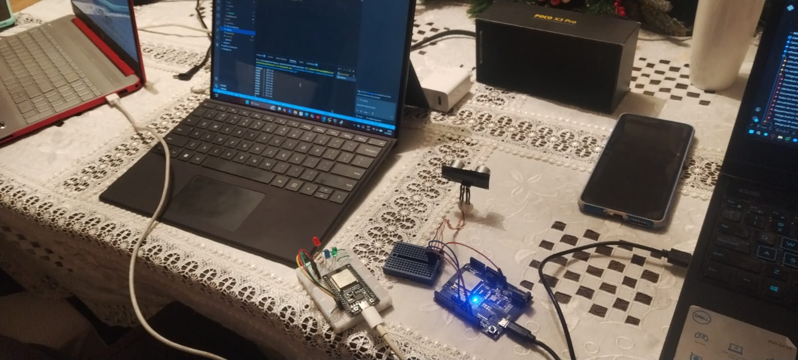

*Figura 16. Montaje general de la práctica.*

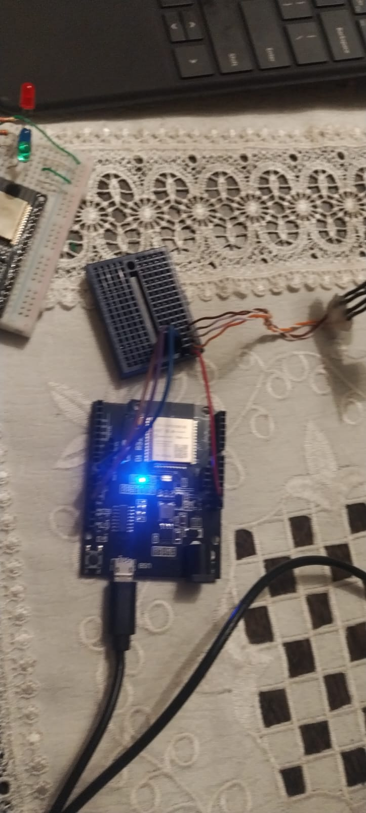

*Figura 17. Módulo ESP32 usado como sensor.*

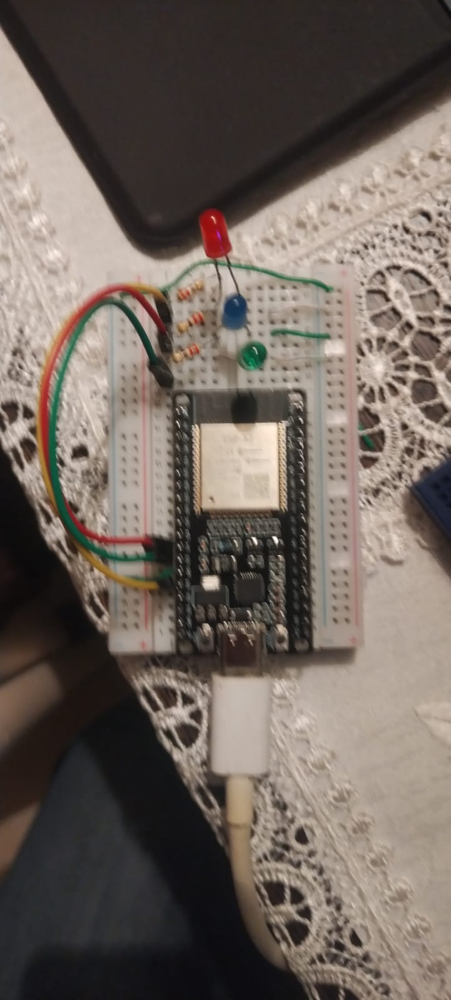

*Figura 18. Módulo ESP32 usado como actuador.*
